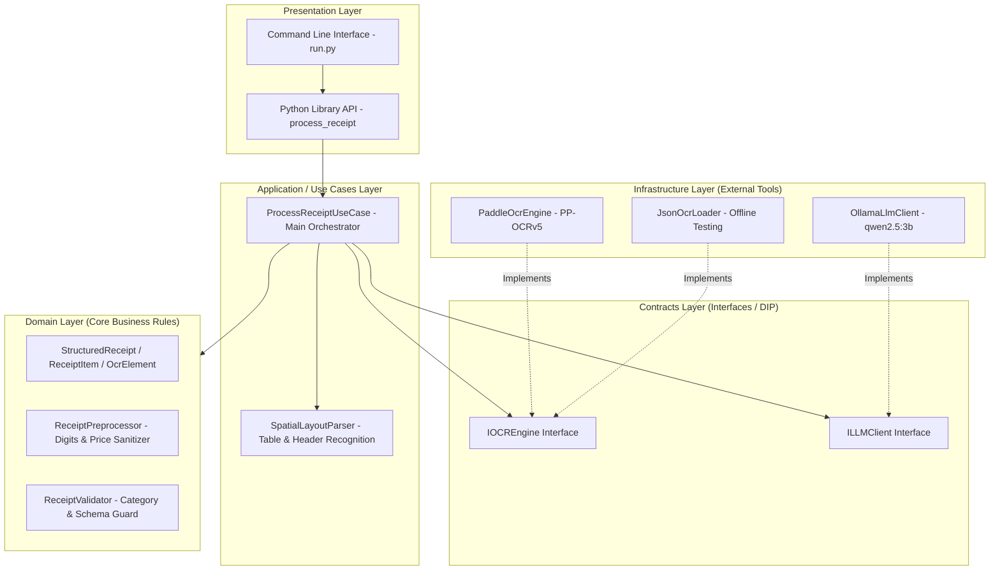

# High-Level Architecture Overview: Bilingual Receipt Expense Engine

## Executive Summary

This system is an enterprise-grade **Bilingual (Arabic/English) Receipt Expense Processing Pipeline**. It ingests raw physical receipt images (or pre-computed OCR JSONs) and transforms them into clean, standardized, structured expense records suitable for financial tracking and database storage.

---

## 1. High-Level Conceptual Workflow


### The 4 Core Stages:

1. **OCR Extraction Layer (`PP-OCRv5`)**
   - Extracts raw text bounding boxes, confidence scores, and spatial coordinates `(x, y)` from receipt images.
   - Fully supports Arabic and English characters simultaneously.

2. **Spatial & Geometric Layout Parsing (`SpatialLayoutParser`)**
   - Applies deterministic rule-based spatial geometry to reconstruct receipt tables without relying blindly on AI.
   - Handles **Right-to-Left (Arabic)** vs **Left-to-Right (English)** horizontal layout directions.
   - Strips quantity/unit prefixes (e.g. `1.000 kg / Onions` -> `Onions`).
   - Extracts merchant name, invoice date, time, currency, subtotal, tax, service charges, discounts, and total.

3. **Semantic LLM Correction (`Ollama qwen2.5:3b`)**
   - Uses a local, privacy-focused LLM to normalize item descriptions and assign standardized expense categories (`Groceries`, `Food`, `Utilities`, etc.).
   - Corrects minor OCR typos while preserving strict original financial prices.

4. **Schema Enforcement & Validation (`ReceiptValidator`)**
   - Enforces strict JSON contracts.
   - Prevents AI hallucinations from dropping line items or altering prices.

---

## 2. Architecture Layers (Clean Architecture & SOLID)



---

## 3. Key Design Choices & Guarantees

| Design Principle | Implementation Benefit |
| :--- | :--- |
| **Deterministic Spatial First** | Prices and item names are paired using geometry, guaranteeing **zero AI hallucination** on numbers. |
| **Dependency Inversion (DIP)** | The core business logic depends on interfaces (`IOCREngine`, `ILLMClient`), allowing you to swap PaddleOCR or Ollama with Cloud APIs (e.g., Azure OCR, OpenAI) without changing a single line of business logic. |
| **Bilingual RTL / LTR Handling** | Intelligently detects Arabic text orientation to select the correct price column (far-left for Arabic, far-right for English). |
| **Unified Nullable Financial Schema** | Optional financial breakdown items (`service_charge`, `discount`, `tax`) default to `null` when missing, preventing financial distortion. |

---

## 4. Standardized Output Schema

```json
{
  "merchant": "Al-Othaim Markets",
  "receipt_number": "381-304-965",
  "date": "2024-05-12",
  "time": "14:32",
  "currency": "SAR",
  "payment_method": "CARD",
  "items": [
    {
      "original_ocr": "بصل / Onions",
      "name": "Onions / بصل",
      "price": 1.28,
      "category": "Groceries",
      "correction_confidence": 0.98
    }
  ],
  "subtotal": 13.58,
  "service_charge": null,
  "discount": null,
  "tax": 0.06,
  "total": 13.64
}
```
