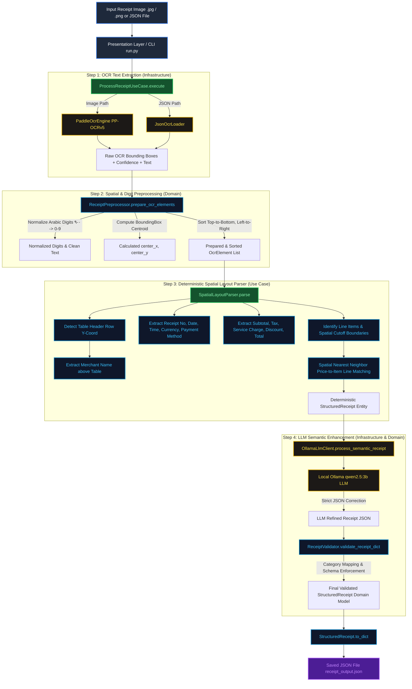

# Bilingual (Arabic/English) Receipt Expense Processing Pipeline
## System Architecture & Complete Flow Documentation

---

### 1. System Architecture Overview

The system is built strictly adhering to **Clean Architecture** and **SOLID Principles**:
- **Domain Layer (`domain/`)**: Enterprise entities, models (`StructuredReceipt`, `ReceiptItem`, `OcrElement`), spatial geometry (`LayoutCalculator`), digit normalization (`ReceiptPreprocessor`), and business validators (`CategoryValidator`, `ReceiptValidator`).
- **Use Cases Layer (`use_cases/`)**: Application orchestrator (`ProcessReceiptUseCase`) and spatial deterministic layout parsing engine (`SpatialLayoutParser`).
- **Contracts Layer (`contracts/`)**: Inversion of Control interfaces (`IOCREngine`, `ILLMClient`).
- **Infrastructure Layer (`infrastructure/`)**: Concrete hardware/external implementations (`PaddleOcrEngine`, `JsonOcrLoader`, `OllamaLlmClient`).
- **Presentation Layer (`presentation/`, `pipeline.py`, `run.py`)**: CLI interfaces and library API endpoints.

---

### 2. Complete End-to-End Image Processing Flow Diagram

Copy the Mermaid snippet below into **Excalidraw** (`More tools -> Mermaid to Excalidraw`) or **Mermaid Live Editor** to visualize the pipeline flow:

---

### 3. Detailed Execution Sequence Diagram

```mermaid
sequenceDiagram
    autonumber
    actor User
    participant CLI as CLI / API (run.py)
    participant UC as ProcessReceiptUseCase
    participant OCR as PaddleOcrEngine
    participant PP as ReceiptPreprocessor
    participant SP as SpatialLayoutParser
    participant LLM as OllamaLlmClient
    participant VAL as ReceiptValidator

    User->>CLI: Execute: python run.py receipt.jpg
    CLI->>UC: execute(input_path="receipt.jpg", use_llm=True)
    
    rect rgb(20, 30, 50)
        Note over UC,OCR: Step 1: OCR Text & Geometry Extraction
        UC->>OCR: extract_text("receipt.jpg", lang="ar")
        OCR-->>UC: Return raw_ocr_items [{text, confidence, box}]
    end

    rect rgb(30, 50, 40)
        Note over UC,PP: Step 2: Digit & Spatial Coordinate Preprocessing
        UC->>PP: prepare_ocr_elements(raw_ocr_items)
        PP-->>UC: Return sorted List[OcrElement]
    end

    rect rgb(50, 40, 20)
        Note over UC,SP: Step 3: Spatial Layout Extraction
        UC->>SP: parse(prepared_ocr)
        SP->>SP: Extract Merchant, Date/Time, Totals, Currency
        SP->>SP: Match Line Items & Prices using RTL/LTR spatial heuristics
        SP-->>UC: Return initial StructuredReceipt domain entity
    end

    rect rgb(50, 20, 50)
        Note over UC,VAL: Step 4: LLM Semantic Correction & Validation
        UC->>LLM: process_semantic_receipt(parsed_receipt, model_name="qwen2.5:3b")
        LLM->>LLM: Call Ollama CLI with structured JSON prompt
        LLM-->>UC: Return raw LLM JSON dict
        UC->>VAL: validate_receipt_dict(raw_llm_json, original_receipt=parsed_receipt)
        VAL-->>UC: Return final StructuredReceipt
    end

    UC->>CLI: Return final_dict JSON
    CLI->>User: Print Structured JSON & Save to receipt_output.json
```

---

### 4. File-by-File Technical Specification

Below is the exhaustive documentation for **every file** in the codebase.

---

#### Core Module (`receipt_processor/`)

1. **`receipt_processor/__init__.py`**
   - **Role:** Package root initialization file.
   - **Responsibilities:** Exports module metadata (`__version__ = "1.0.0"`) and primary API functions for library consumption.

2. **`receipt_processor/__main__.py`**
   - **Role:** Module execution entry point.
   - **Responsibilities:** Enables running the package directly via `python -m receipt_processor <image_path>`. Delegates to `receipt_processor.presentation.cli.main()`.

3. **`receipt_processor/config.py`**
   - **Role:** Centralized configuration repository.
   - **Responsibilities:** Defines system-wide defaults such as `DEFAULT_OLLAMA_MODEL = "qwen2.5:3b"`, default OCR parameters, timeout durations, and file path defaults.

---

#### Abstractions Layer (`receipt_processor/contracts/`)

4. **`receipt_processor/contracts/ocr_engine.py`**
   - **Role:** OCR Interface (Dependency Inversion Principle).
   - **Responsibilities:** Defines abstract base class `IOCREngine` with `@abstractmethod def extract_text(self, image_path: str, lang: str = "ar") -> List[Dict[str, Any]]`.

5. **`receipt_processor/contracts/llm_client.py`**
   - **Role:** LLM Interface (Dependency Inversion Principle).
   - **Responsibilities:** Defines abstract base class `ILLMClient` with `@abstractmethod def process_semantic_receipt(self, receipt: StructuredReceipt, model_name: Optional[str] = None) -> StructuredReceipt`.

---

#### Domain Layer (`receipt_processor/domain/`)

6. **`receipt_processor/domain/models.py`**
   - **Role:** Enterprise Domain Models & Data Structures.
   - **Classes:**
     - `BoundingBox`: Holds 4-point geometric coordinates and calculates centroid properties (`center_x`, `center_y`).
     - `OcrElement`: Represents a single detected OCR block containing `text`, `confidence`, `box`, `center_x`, `center_y`, `is_number`, `contains_arabic`.
     - `ReceiptItem`: Domain entity for a parsed receipt item (`original_ocr`, `name`, `price`, `category`, `correction_confidence`).
     - `StructuredReceipt`: Domain entity representing the unified receipt schema (`merchant`, `receipt_number`, `date`, `time`, `currency`, `payment_method`, `items`, `subtotal`, `discount`, `service_charge`, `tax`, `total`).

7. **`receipt_processor/domain/category_rules.py`**
   - **Role:** Expense Taxonomy Rules & Validation.
   - **Responsibilities:** Stores `ALLOWED_CATEGORIES` list and `CategoryValidator.validate_category()` normalizes category cases.

8. **`receipt_processor/domain/layout_calculator.py`**
   - **Role:** Spatial Geometry Engine.
   - **Responsibilities:** Computes `y_distance`, `x_distance`, and `euclidean_distance` between spatial bounding box centroids.

9. **`receipt_processor/domain/preprocessor.py`**
   - **Role:** Digit Normalization, Currency Detection & Text Cleaning.
   - **Responsibilities:**
     - `normalize_digits()`: Converts Eastern Arabic numerals (`٠١٢٣٤٥٦٧٨٩`) to standard ASCII digits (`0-9`).
     - `parse_number_value()`: Sanitizes prices, strips trailing OCR artifacts (`17.0C` -> `17.0`), handles `,` vs `.` decimal representations.
     - `strip_quantity_prefix()`: Removes item weight/quantity prefixes.
     - `prepare_ocr_elements()`: Transforms raw OCR output dicts into sorted `OcrElement` domain objects.

10. **`receipt_processor/domain/validator.py`**
    - **Role:** Robust Data Schema & Fallback Protection.
    - **Responsibilities:** `ReceiptValidator.validate_receipt_dict()` validates raw JSON outputs from the LLM, preserving original spatial OCR values if the LLM drops or hallucinates items.

---

#### Use Cases Layer (`receipt_processor/use_cases/`)

11. **`receipt_processor/use_cases/spatial_parser.py`**
    - **Role:** Deterministic Spatial Layout Extraction Engine.
    - **Responsibilities:**
      - `detect_table_header_y()`: Identifies Y-coordinate boundary of itemized table headers.
      - `extract_merchant_name()`: Locates merchant header text above metadata boundary.
      - Extracts metadata (`date`, `time`, `receipt_number`, `currency`, `payment_method`).
      - Parses totals (`subtotal`, `service_charge`, `discount`, `tax`, `total`).
      - Performs RTL vs LTR price column spatial matching.

12. **`receipt_processor/use_cases/process_receipt.py`**
    - **Role:** Application Use Case Orchestrator (`ProcessReceiptUseCase`).
    - **Responsibilities:** Receives `IOCREngine` and `ILLMClient` dependencies via Dependency Injection and drives the 6-step pipeline.

---

#### Infrastructure Layer (`receipt_processor/infrastructure/`)

13. **`receipt_processor/infrastructure/paddle_ocr_engine.py`**
    - **Role:** Concrete PaddleOCR Integration (`PP-OCRv5`).
    - **Responsibilities:** Lazy-loads `PaddleOCR` instance (`lang="ar"`) and normalizes output into generic bounding box dictionaries.

14. **`receipt_processor/infrastructure/json_ocr_loader.py`**
    - **Role:** Development & Mocking OCR Loader.
    - **Responsibilities:** Reads pre-extracted OCR JSON files directly for offline debugging and rapid unit testing.

15. **`receipt_processor/infrastructure/ollama_llm_client.py`**
    - **Role:** Local LLM Integration (`Ollama`).
    - **Responsibilities:** Formats structured prompt containing allowed categories and spatial receipt output, invoking local `qwen2.5:3b` model via CLI subprocess.

---

#### Presentation Layer & Utilities

16. **`receipt_processor/presentation/api.py`**
    - **Role:** Python Library API Entry Point (`process_receipt()`).

17. **`receipt_processor/presentation/cli.py`**
    - **Role:** Command Line Interface (`argparse`).

18. **`receipt_processor/pipeline.py`**
    - **Role:** Convenience Facade Module re-exporting `process_receipt()`.

19. **`run.py`**
    - **Role:** Top-level Executable Runner Script.

---

#### Tests & Benchmarking (`tests/`)

20. **`tests/test_pipeline.py`**
    - **Role:** Automated Pytest Test Suite (11 passing unit/integration tests).

21. **`tests/benchmark_ocr.py`**
    - **Role:** Performance & Benchmark Harness comparing `PaddleOCR` vs `PP-StructureV3`.
